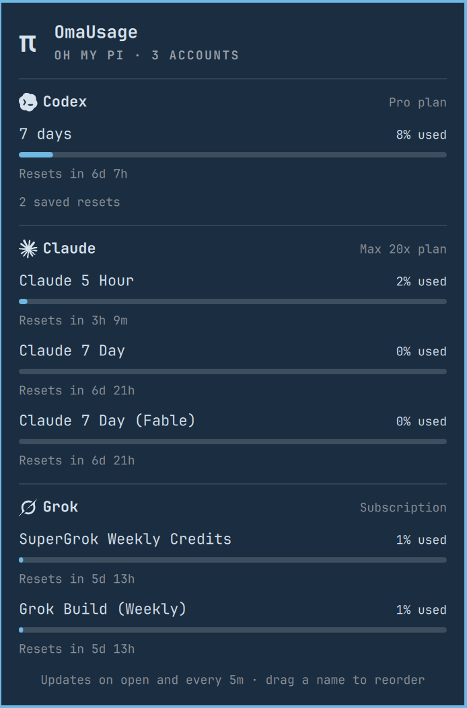

# OmaUsage

Subscription limits for every AI account logged in to [Oh My Pi](https://github.com/can1357/oh-my-pi), in the Omarchy bar. Each provider shows up as its own logo with a percentage next to it.

Forked from [omarchy-omp-usage](https://github.com/Mirceone/omarchy-omp-usage) by Mirceone. The usage polling, plan lookups, and panel are theirs. This fork replaces the signal-bar icon with provider logos and adds the display settings below.



## What it shows

The bar gets one reading per account: the provider's logo and how much is left of its tightest limit. If Claude's 5-hour window is at 40% and its weekly window at 10%, the bar says 60%, because that's the one that stops you first. A reading turns the urgent colour at 90% used. Hover for every account at once.

On a vertical bar the number sits under the logo and drops the `%` so it fits.

The panel lists every limit per account with a meter, spend figures where the provider reports them, reset times, and the plan ("Pro plan", "Max 20x plan", or "Subscription" / "API key" when the plan isn't exposed). Drag an account's name to reorder; the bar follows the same order.

Logos ship for Claude, Codex, OpenAI, Cursor, Copilot, Gemini, Grok, Z.ai, Kimi, OpenRouter, Perplexity, Kilo and Fireworks. Any other provider gets its initial. The logos are drawn in the bar's text colour, so they follow your theme.

## Settings

Change these with the toggles at the bottom of the panel, from the widget settings, or with `omarchy bar set`:

| Key | Values | Default | |
|---|---|---|---|
| `barDisplay` | `all`, `most-used` | `all` | Every account in the bar, or only the one with the least left |
| `percentShown` | `left`, `used` | `left` | Percent left or percent used, in the bar, tooltip and panel |
| `refreshIntervalSec` | 30 to 3600 | 300 | How often usage is checked, besides each time the panel opens |

```bash
omarchy bar set io.github.terrifiedbug.omausage barDisplay most-used
omarchy bar set io.github.terrifiedbug.omausage percentShown used
```

## Requirements

- Omarchy with the Quickshell shell
- [Oh My Pi](https://github.com/can1357/oh-my-pi) (`omp` on `PATH`) with at least one account logged in via `/login`
- `bash`
- `sqlite3` (installed with Omarchy), used to notice account logins and logouts
- `python3` (optional), used only for exact Claude and Cursor plan names; without it those show "Subscription"

## Install

```bash
omarchy plugin add https://github.com/TerrifiedBug/omausage.git --enable
```

If you also have the original OMP Usage plugin installed, disable it so you don't get two widgets:

```bash
omarchy plugin disable omp.usage-monitor
```

## Remove

```bash
omarchy plugin remove io.github.terrifiedbug.omausage
rm -f ~/.local/state/omarchy/omausage.json   # saved account order
```

## What it accesses

- Runs `omp usage --json` and `omp usage --history --json`. All usage data comes from there.
- Every 30 seconds and when the panel opens, reads which accounts are logged in from OMP's credential store (`~/.omp/agent/agent.db`, read-only) with `sqlite3`. It reads provider, credential type and account identity, never tokens.
- `plans.py` reads the same store (read-only) to look up Claude and Cursor plan names. Each token goes only to the provider that issued it (`api.anthropic.com`, `api2.cursor.sh` / `cursor.com`) and is never printed, logged or stored. Lookups refuse redirects, cap responses at 1 MiB, and give up after 8 seconds.
- Anthropic throttles its usage endpoint, so Claude is polled at most once a minute with backoff, and OMP's recorded usage fills the gaps. Stale data is labelled as stale.
- Writes only `~/.local/state/omarchy/omausage.json` (your account order).

## License

MIT. Provider logos are path data from [lobe-icons](https://github.com/lobehub/lobe-icons) (MIT); see NOTICE.
